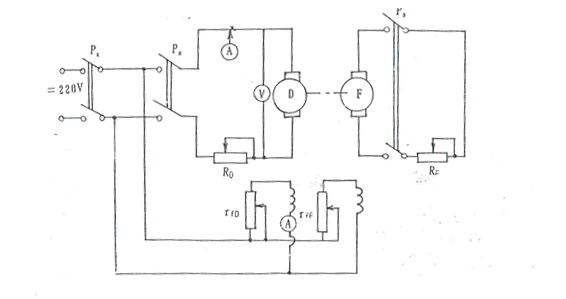

<h1><div align='center'>扩展设计一</div></h1>

<div align='right'>2052110 郭子瞻</div>

## 问题描述

一台并励直流电机的额定参数如下：

$$
\left\{ \begin{aligned}
P_{N} &= 17 \text{kW} \\
U_{N} &= 220 \text{V} \\
n_{N} &= 3000 \text{r/min} \\
I_{N} &= 88.9 \text{A} \\
R_{a} &= 0.114 \Omega \\
R_{f} &= 181.5 \Omega
\end{aligned} \right.
$$

设计直流电机的磁路和电路模型，完成**直流电动机工作特性测定**功能。

---

## 设计说明

### 功能与创新点

- 依照下面详细的数学模型构建了直流电机的线性模型
- 可以通过输入电机的负载的具体数值，或者拖动滑块来改变发电机端电阻的值（类似滑动变阻器滑片）
- 可以实时读取电机转速和电枢绕组的电流值（人为引入了一定的随机误差）
- 增加了采样、绘图、使用线性模型拟合数据
- 可以通过修改配置文件更改电机的参数。

### 电机的数学建模

将并励电机视为一个线性时不变系统，输入为：

- 绕组电压（同时为励磁绕组电压和电枢绕组电压）$U$
- 负载（机械负载）$T_{2}$

输出为电机的转速 $n$（单位为 r/min）或 $\Omega$（单位为 rad/s）。

为了便于在程序中量化电机的数学模型，在这里说明对电机损耗和磁路模型的取舍：

1. 铜耗：考虑了线性电阻的焦耳热，包括电枢绕组、励磁绕组，但是忽略了电刷压降损耗，在电路方程中表现为电枢绕组电阻 $R_{a}$ 和励磁绕组电阻 $R_{f}$；
2. 铁耗和机械损耗：考虑，但是忽略转速变化引起的变化，在机械方程中表现为常量空载转矩 $T_{0}$；
3. 附加损耗：不考虑；
4. 磁路模型：认为在调节范围内，磁通和励磁电流成正比，系数为 $K_{f}$。

电路方程：

$$
\begin{aligned}
U &= I_{a} R_{a} + C_{T} \Phi \Omega + 2 \Delta U_{c} \\
& \approx I_{a} R_{a} + C_{T} \Phi \Omega \\
U &= I_{f} R_{f} + L_{f} \frac{\mathrm{d}I_{f}}{\mathrm{d}t} \\
& \approx I_{f} R_{f}
\end{aligned}
$$

磁路方程：

$$
\Phi = f(I_{f}) \approx K_{f} I_{f}
$$

机械方程：

$$
T_{em} = T_{0} + T_{2}
$$

机电方程：

$$
T_{em} = C_{T} \Phi I_{a}
$$

综合上述方程组，得到：

$$
\begin{aligned}
\Omega &= \frac{R_{f}}{C_{T}K_{f}} - \frac{R^{2}_{f}R_{a}}{(C_{T}K_{f})^{2}} \cdot \frac{T_{0}+T_{2}}{U^{2}} \\
n &= \frac{60}{2\pi} \Omega
\end{aligned}
$$

需要标定的参数有：

- $C'_{T} = C_{T}K_{f}$
- $T_{0}$
- $R_{f}$
- $R_{a}$

问题描述中给出了电阻参数和额定状态，下面根据已知参数推导上面需要标定的参数 $C'_{T}$ 和 $T_{0}$.

$$
\begin{aligned}
C'_{T} \frac{U_{N}}{R_{f}} \Omega_{N} &= U_{N} - \left(I_{N} - \frac{U_{N}}{R_{f}}\right) R_{a} \\
\Omega_{N} &= \frac{2\pi}{60} n_{N} \\
T_{2N} &= \frac{P_{N}}{\Omega_{N}} \\
T_{2N} + T_{0} &= C'_{T} \frac{U_{N}}{R_{f}} \left(I_{N} - \frac{U_{N}}{R_{f}}\right)
\end{aligned}
$$

求解得到

$$
\left\{ \begin{aligned}
C'_{T} &= \frac{60R_{f}}{2\pi n_{N}} \left( 1 + \frac{R_{a}}{R_{f}}- \frac{I_{N}R_{a}}{U_{N}} \right) \\
T_{0} &= \frac{60}{2\pi n_{N}} \left[ U_{N}\left(I_{N} - \frac{U_{N}}{R_{f}}\right)\left( 1 + \frac{R_{a}}{R_{f}} - \frac{I_{N}R_{a}}{U_{N}} \right) - P_{N} \right]
\end{aligned} \right.
$$

因此，给定一组额定状态和电枢绕组、励磁绕组的电阻值，就可以得到电机的模型。对于题目中的数据：

$$
\begin{aligned}
C'_{T} &= 0.551 \Omega \cdot \text{s} \\
T_{0} &= 4.50 \text{N} \cdot \text{s}
\end{aligned}
$$

### 实验测量电路



如图所示，励磁线圈和电枢并联在输入电压 220 V 上，构成并励电动机。电动机拖动发电机旋转，发电机电枢再接入一个负载电阻 $R_{F}$. 实验中可以通过调节 $R_{F}$ 定性地改变电动机的负载转矩 $T_{2}$.

## 使用说明

### 依赖环境

- Python 3.9 及以上
- Numpy 1.21.5 及以上
- Matplotlib 3.5.2 及以上
- 操作系统不做限制，但必须有图形界面显示功能

推荐直接安装 [Anaconda3](https://anaconda.org/). 其中连带了所有满足要求的 Python 库。

### 运行方法

- 可以使用 IDE （例如 Pycharm，Vscode）打开后点击“运行”；
- 也可以打开终端，直接输入命令
    - Windows 下的 Cmd Prompt/Powershell
    - Linux 下的 Bash

命令需要先到达程序源码所在目录，执行：

```shell
python dc-motor.py
```

### 文件说明

.
├── dc-motor.py 程序源码
├── images 存放图片的文件夹
│   ├── motor.ico 可视化 UI 左上角图标
│   └── schematic.png 可视化 UI 中的电路图
├── motor-config.json 电机模型参数配置文件
└── README.md 项目说明

```shell
.
├── dc-motor.py # 程序源码
├── images # 存放图片的文件夹
│   ├── motor.ico # 可视化 UI 左上角图标
│   ├── README-default.png
│   ├── README-json.png
│   ├── README-lstsq.png
│   ├── README-scatter.png # 上面四条为报告中的图片
│   └── schematic.png # 可视化 UI 中的电路图
├── motor-config.json # 电机模型参数配置文件
├── README.md # 项目说明
└── report.pdf # 项目报告
```

运行程序的时候，最好不要改动项目内部的目录和文件位置。改动 images 文件夹或内部文件会导致程序出错，改动 motor-config.json 配置文件会导致无法修改配置，电机只能按照给定的参数运行而无法修改。

---

### 功能描述

打开应用，显示如下界面，包括左上角的电路图，左下角的控制面板和右侧的转速、电流关系曲线（默认状态下为空）


进入程序界面以后，默认为额定工作状态。可以使用两种方法改变电机的输入负载：

1. 在“输入电机负载（单位 $\text{N} \cdot \text{m}$）”字样下侧的文本框内输入负载的精确值，之后**点击“确定”**。
2. 拖动“移动滑动条改变电阻 $R$）”字样下的电阻条，向右表示变大。

执行完上述步骤后，控制面板中会显示对应负载下的电机转速和电枢电流值。

- 如果要记录此数据，需要点击“采样”按钮，将数据保存到数据队列中；
- 如果不要记录此数据，直接重复上一步骤即可改变电机输入负载，而且不加入数据。

点击“绘图”按钮，可以将数据队列中的所有数据以<u>散点图</u>的形式绘出，如下图所示：


当<u>采样的数据数量不少于 2 个</u>时，可以点击“拟合”按钮，对散点图数据进行基于最小二乘法的线性拟合，调用了 numpy 库的 ``np.linalg.lstsq`` 函数。


右侧图片的绘制调用了 Matplotlib.pyplot 库，将其嵌入了 tkinter 框架中，图线的标题为线性拟合的方程。

注意到由于人为引入了误差，数据点将不可能精确地在同一直线上。

### 改变参数

本项目支持修改电机的参数。使用 vscode 打开 motor-config.json 文件如下图所示：


其中 PN, UN, nN, IN 是额定参数 $P_{N}, U_{N}, n_{N}, I_{N}$，Ra, Rf 是 $R_{a}, R_{f}$，error 是相对误差水平，图中 0.05 表示 5\% 的相对误差。PN 为 17e3，即 $P_{N} = 17 \text{kW}$

可以使用文本编辑器来修改参数以得到不同参数下直流电机的固有特性曲线。
